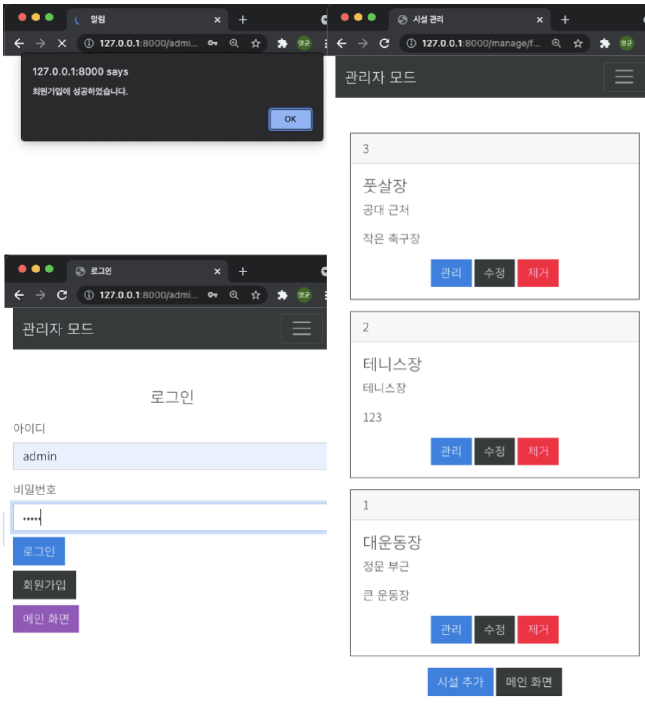

# 학교 시설 예약 프로그램

- ## 프로젝트 추진 배경

현재 교내에서의 여러 시설물의 예약 관리시스템의 대부분이 수기로 작성되어 진행되어 소프트웨어로 대체

- ## 최종 목표 및 세부 목표

JSP와 Thymleaf 를 사용해 구현
( 추후 front(react), back-end(springboot) 분리 예정 json 이용, RESTful 형식 )

네트워크 상에서 Client와 Server 사이의 통신 방식을 익힐 것

- ## 기능

[학생] 등록 / 로그인 / 정보 조회 / 정보 수정 / 탈퇴 

[관리자] 등록 / 로그인 / 정보 조회 / 정보 수정 / 탈퇴  

[시설] 조회 / 등록 / 수정 / 삭제  (관리자 권한 부여)

[시설 예약] 조회 / 신청 / 취소 

[시설 관리] 조회 / 신청 / 취소

- ## 개발 환경

#### [Back-end ]

- vscode
- Spring Boot 2.5.4
- Java 11
- Maven
- Jar packages
- Thymeleaf
- PostgreSQL

- ## 산출물

**구현하면서 생긴 문제점 / 추가 기능**

- 시간이 지난 예약/관리 안보여주기
- 동시성 제어
- 참조 제약조건으로 ON DELETE CASCADE ex) 관리자, 시설, 사용자 탈퇴시 사용자가 예약한 목록이 남아있어 삭제 안됨 -  사용자가 예약한 목록 삭제 후 사용시 삭제
- 창 크기에 따라 달라지는 반응형 인터페이스 설정

### 느낀점

이론으로만 배운 개념을 실제로 프로젝트에 적용하며 확실하게 공부하는 시간을 가졌는데요.

실제로 프로젝트를 진행하면서 데이터 모델링 했을 때 놓치는 부분과 관계형 데이터를 유지하기 위해 무결성 제약조건이 필요한 부분을 배웠습니다.

모델링을 해보고 프로젝트를 진행했을 때 모델링한 관계형 데이터베이스가 어떤 로직을 가지고 작동되는지, 정규화를 어떤 식으로 해야 하는지 경험하는 시간이었습니다.

추후 프론트와 백앤드를 분리해 구현할 예정이다.